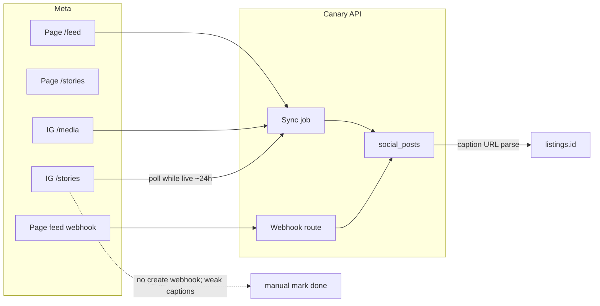

# Phase: Social Publishing (Meta) - Research

**Researched:** 2026-08-13
**Domain:** Facebook Pages API + Instagram Graph API (Content Publishing, Stories, Webhooks, App Review)
**Confidence:** HIGH (official Meta docs; one rate-limit contradiction noted)

## Summary

v1 can API-sync **Facebook Page feed** and **Instagram feed** with read-only permissions. **Stories should stay “manual mark done” in v1** even if feed is synced: IG `/media` omits stories, `/stories` is 24h-only, and there is **no webhook for new IG media**. Facebook Page stories are a separate API (readable + publishable), not IG-only.

**Primary recommendation:** Model `channel` (facebook|instagram) × `surface` (feed|story|reel), store Meta IDs + permalinks, copy media into our storage, match listings from caption URLs. Use a BM **System User** for unattended access. Defer publish permissions and App Review until later.

### Key findings → data model

1. **Page feed read ≠ publish.** Same edge `GET|POST /{page-id}/feed` with a **Page access token**. Read: `pages_read_engagement` + `pages_show_list`. Publish later: `pages_manage_posts` + `CREATE_CONTENT`. [Page Feed](https://developers.facebook.com/docs/graph-api/reference/page/feed/), [Pages API Posts](https://developers.facebook.com/docs/pages-api/posts/). **Model:** `platform_post_id`, `permalink_url`, `message`, `created_time`, `is_published`.

2. **IG feed vs stories are different endpoints.** `GET /{ig-user-id}/media` returns feed (max 10k); **“Story IG Media not supported.”** Stories: `GET /{ig-user-id}/stories` (24h; no live; no reshared). Publish later: `POST /{ig-user-id}/media` (`media_type=STORIES`) then `POST /media_publish`. [IG User Media](https://developers.facebook.com/docs/instagram-platform/instagram-graph-api/reference/ig-user/media/), [Stories](https://developers.facebook.com/docs/instagram-platform/instagram-graph-api/reference/ig-user/stories/). **Model:** `surface`, `expires_at` (stories), copy `media_url` immediately (URLs expire).

3. **Facebook Page stories exist.** [Page Stories API](https://developers.facebook.com/docs/page-stories-api/): `GET /{page-id}/stories` (`PUBLISHED`|`ARCHIVED`), `POST /photo_stories` / `/video_stories`. Not IG-only. **Model:** facebook + `surface=story` is first-class.

4. **App Review: own BM vs SaaS.** Own business + app roles = **Standard Access, review not required**. Tech provider / other businesses = **Advanced Access**. [App Review for Instagram API](https://developers.facebook.com/docs/instagram-platform/app-review/), [Access Levels](https://developers.facebook.com/docs/graph-api/overview/access-levels/). **v1 read:** `pages_show_list`, `pages_read_engagement`, `instagram_basic`. **Later publish:** `pages_manage_posts`, `instagram_content_publish` (depends on basic + page read + show_list). `pages_manage_metadata` for webhooks. `business_management` for BM/system users. Skip `instagram_manage_insights` until insights. [Permissions Reference](https://developers.facebook.com/docs/permissions/).

5. **Unattended auth: System User.** [System Users](https://developers.facebook.com/docs/business-management-apis/system-users/) + [API Calls](https://developers.facebook.com/docs/marketing-api/system-users/guides/api-calls/): generate system-user token, `GET /me/accounts` → Page token. [Long-Lived Page tokens](https://developers.facebook.com/docs/facebook-login/guides/access-tokens/get-long-lived/) never expire but die if the human loses Page role. [Facebook Login for Business](https://developers.facebook.com/docs/facebook-login/facebook-login-for-business/) later for multi-tenant (request **system-user** token type). **Model:** encrypted `system_user_token` + `page_access_token`; IG publish docs want a **User** token, Page ops a **Page** token.

6. **Webhooks: FB feed yes, new IG media no.** Page `feed` via `POST /{page-id}/subscribed_apps`. [Webhooks for Pages](https://developers.facebook.com/docs/pages-api/webhooks-for-pages/). IG webhooks: comments, mentions, **`story_insights` after expiry**, messages — **not new posts**. [Webhooks for Instagram](https://developers.facebook.com/docs/graph-api/webhooks/getting-started/webhooks-for-instagram/). **Model:** webhook cursor for FB feed; **poll** IG `/media` and `/stories`.

7. **Listing match is caption-only.** FB `message` + `permalink_url`; IG `caption` + `permalink`. No Meta listing-id. Stories often have no caption/URL → **cannot auto-link**. **Model:** `listing_id` nullable; `match_method` (`url_in_caption`|`manual`).

8. **Stories stay manual even if feed is API-synced.** IG `/media` omits stories; `/stories` 24h + gaps; no create webhook; weak captions. Keep story tasks `status=manual` until we publish them ourselves and persist `creation_id` → media id.

## Architectural Responsibility Map

| Capability | Primary Tier | Secondary Tier | Rationale |
|------------|-------------|----------------|-----------|
| OAuth / System User token storage | API / Backend | Database / Storage | Tokens never in the browser |
| Sync Page/IG feed | API / Backend | Database / Storage | Server polls Graph + writes rows |
| Page `feed` webhooks | API / Backend | — | HTTPS callback; verify `X-Hub-Signature-256` |
| Story ingest (IG) | API / Backend | — | Poll `/stories` during 24h window |
| Listing match from caption URL | API / Backend | — | Parse caption; no Meta listing field |
| Manual “mark done” for stories | Browser / Client | API / Backend | UI action when API cannot confirm |
| Later: unattended publish | API / Backend | — | System User; no person online |
| Later: AI captions | API / Backend | — | Generate then POST as `message`/`caption` |

## Standard Stack

### Core

| Library | Version | Purpose | Why Standard |
|---------|---------|---------|--------------|
| Graph API HTTP (`graph.facebook.com`) | v21+ (docs show v25–v26) | All Page + IG calls | Official; no extra SDK required [CITED: developers.facebook.com] |
| Next.js Server Actions / Route Handlers | project Next 15.x | Token proxy, webhooks, sync jobs | Matches Canary stack; tokens stay server-side |
| Supabase (existing) | hosted | Store posts, tokens, media copies | Existing persistence + RLS |

### Supporting

| Library | Version | Purpose | When to Use |
|---------|---------|---------|-------------|
| Vercel cron or Supabase scheduled function | — | Poll IG media/stories | Required; no IG “new media” webhook |
| Supabase Storage | hosted | Copy `media_url` / story frames | `media_url` is not durable |

### Alternatives Considered

| Instead of | Could Use | Tradeoff |
|------------|-----------|----------|
| Raw Graph HTTP | `facebook-nodejs-business-sdk` | Marketing-API oriented; extra surface for Page/IG publish |
| System User | Long-lived Page token from a person | Simpler setup; breaks if that person loses Page role |
| System User (v1 one-org) | Facebook Login for Business | Required later for SaaS tenants, not for Canary-only BM |

**Installation:** none for Graph. Do not add a Meta SDK in v1.

**Version verification:** Graph is HTTP, not an npm package. Current docs use **v25.0 / v26.0** (2026). Pin `GRAPH_API_VERSION` in env (e.g. `v22.0` or current stable).

## Package Legitimacy Audit

No new npm packages recommended.

| Package | Registry | slopcheck | Disposition |
|---------|----------|-----------|-------------|
| — | — | — | none |

**Packages removed due to slopcheck [SLOP] verdict:** none
**Packages flagged as suspicious [SUS]:** none

## Architecture Patterns

### System Architecture Diagram



### Recommended Project Structure

```
app/api/meta/webhook/route.ts   # Page feed + IG webhook verify
lib/meta/graph.ts               # versioned fetch wrapper
lib/meta/tokens.ts              # decrypt system user + page tokens
lib/meta/sync-page-feed.ts
lib/meta/sync-ig-media.ts
lib/meta/sync-ig-stories.ts     # optional v1; else skip
lib/meta/match-listing.ts       # URL-in-caption
```

### Pattern 1: Page token from System User
**What:** System user token → `GET /me/accounts` → Page token for Page edges.
**When to use:** Unattended sync/publish for one BM.
**Example:**
```http
GET https://graph.facebook.com/v22.0/me/accounts?access_token={SYSTEM_USER_TOKEN}
```
Source: [System Users API Calls](https://developers.facebook.com/docs/marketing-api/system-users/guides/api-calls/)

### Pattern 2: IG two-step publish (later)
```http
POST /{ig-user-id}/media?image_url=...&caption=...&media_type=STORIES
POST /{ig-user-id}/media_publish?creation_id={container-id}
```
Source: [IG User Media](https://developers.facebook.com/docs/instagram-platform/instagram-graph-api/reference/ig-user/media/), [media_publish](https://developers.facebook.com/docs/instagram-platform/instagram-graph-api/reference/ig-user/media_publish/)

### Anti-Patterns to Avoid
- **Using `/media` to sync stories:** official limitation; use `/stories`.
- **Storing Meta `media_url` as the only copy:** URLs expire / omitted for some video.
- **Requesting publish permissions in v1 App Review:** harder screencast; not needed for read.
- **Relying on a staff member’s User token for cron:** invalidates on password/role change.
- **Assuming IG webhook = new post:** it does not.

## Don't Hand-Roll

| Problem | Don't Build | Use Instead | Why |
|---------|-------------|-------------|-----|
| OAuth for other businesses | Custom OAuth | Facebook Login for Business | Config IDs, system-user tokens |
| Webhook authenticity | Trust raw POST | `X-Hub-Signature-256` vs App Secret | Official Webhooks docs |
| Token persistence | Plaintext in DB | Encrypted column / secret store | Page tokens are durable credentials |
| Rate-limit tracking | Guess | `GET /{ig-user-id}/content_publishing_limit` | Official quota |

**Key insight:** Graph already splits feed vs stories vs publish; the data model must mirror that split, not a single `posts` list.

## Common Pitfalls

### Pitfall 1: Treating stories as feed rows
**What goes wrong:** Empty story sync; false “posted” from missing `/media` rows.
**Why:** [IG User Media](https://developers.facebook.com/docs/instagram-platform/instagram-graph-api/reference/ig-user/media/) excludes stories.
**How to avoid:** Separate `surface`; stories manual unless we published them.
**Warning signs:** Feed sync works; story checklist never auto-completes.

### Pitfall 2: Page token vs User token for IG publish
**What goes wrong:** IG `media_publish` fails; Page `/feed` works.
**Why:** [media_publish](https://developers.facebook.com/docs/instagram-platform/instagram-graph-api/reference/ig-user/media_publish/) documents a **User** token.
**How to avoid:** Store both tokens; use system-user token for IG, Page token for Page.

### Pitfall 3: App Review vs own-BM Standard Access
**What goes wrong:** Blocked waiting for review that isn’t required yet.
**Why:** [App Review for Instagram API](https://developers.facebook.com/docs/instagram-platform/app-review/) — own business = Standard Access, not required.
**How to avoid:** Add operators as app roles; System User in same BM. Review when selling as SaaS.

### Pitfall 4: IG rate-limit docs disagree
**What goes wrong:** Over-scheduling.
**Why:** Content Publishing page says **100**/24h and also **50**/24h; `content_publishing_limit.config.quota_total` is **50**. [CITED, sources contradict]
**How to avoid:** Enforce 50 until quota endpoint says otherwise.

## Code Examples

### Read Page posts
```http
GET /{page-id}/feed?fields=id,message,permalink_url,created_time,is_published,full_picture
Authorization: Bearer {PAGE_ACCESS_TOKEN}
```
Source: [Page Feed](https://developers.facebook.com/docs/graph-api/reference/page/feed/)

### Read IG feed (not stories)
```http
GET /{ig-user-id}/media?fields=id,caption,permalink,media_url,media_type,media_product_type,timestamp
```
Source: [IG User Media](https://developers.facebook.com/docs/instagram-platform/instagram-graph-api/reference/ig-user/media/)

### Read live IG stories
```http
GET /{ig-user-id}/stories?fields=id,media_type,media_url,timestamp,permalink
```
Requires `instagram_basic` + `pages_read_engagement`. Source: [Stories](https://developers.facebook.com/docs/instagram-platform/instagram-graph-api/reference/ig-user/stories/)

## State of the Art

| Old Approach | Current Approach | When Changed | Impact |
|--------------|------------------|--------------|--------|
| IG stories not publishable via Graph | `media_type=STORIES` on `/media` | Documented on current IG User Media (user_tags on stories noted 2025-07-09) | We can publish IG photo stories later |
| User token only | System User + Login for Business system-user tokens | Current Login for Business | Unattended SaaS path exists |
| Poll everything | Page `feed` webhooks; IG still mostly poll | Current Webhooks for Pages / Instagram | Hybrid ingest |

**Deprecated/outdated:**
- `manage_pages` / `publish_pages` — replaced by `pages_*` granular permissions.
- Instagram Basic Display for this use case — use Instagram Graph (Facebook Login) with a professional account linked to the Page.

## Assumptions Log

| # | Claim | Section | Risk if Wrong |
|---|-------|---------|---------------|
| A1 | Story link stickers / “add link” are not returned as `caption` for listing match | Finding 7–8 | If Meta returns a link field, auto-match could work for some stories |
| A2 | Page `feed` webhook does not reliably replace `GET /{page-id}/stories` | Finding 3, 6 | If `item=story` covers Page Stories API, we could sync FB stories via webhook |
| A3 | Pinning Graph v22+ is sufficient vs v26 | Standard Stack | Older versions may miss STORIES publish fields |

## Open Questions

1. **Does Page `feed` webhook fire for Page Stories API objects?**
   - What we know: `feed` covers posts/shares/likes; item enum includes `story`.
   - What’s unclear: whether that is Page Stories vs feed “story” copy.
   - Recommendation: poll `GET /{page-id}/stories` if we ingest FB stories; don’t block v1 feed on this.

2. **IG publish quota 50 vs 100**
   - What we know: quota endpoint sample `quota_total: 50`; narrative also says 100.
   - Recommendation: treat **50** as the cap until the quota endpoint says otherwise.

## Environment Availability

| Dependency | Required By | Available | Version | Fallback |
|------------|------------|-----------|---------|----------|
| HTTPS public URL | Page/IG webhooks | env-dependent | — | Poll-only v1 (required for IG anyway) |
| Meta app in Canary BM | All Graph calls | must create | — | Blocker until app + System User exist |
| Node.js | Next.js sync/webhooks | ✓ (project) | Next 15.x | — |

**Missing dependencies with no fallback:**
- Meta app + System User + Page/IG asset assignment (ops setup, not code)

**Missing dependencies with fallback:**
- Webhooks → poll Page `/feed` as well as IG

Step 2.6: Meta app is an external dependency; local Node is sufficient to write the client.

## Validation Architecture

No `.planning/config.json` (`nyquist_validation` absent → treat enabled). No Meta test suite in-repo.

### Test Framework
| Property | Value |
|----------|-------|
| Framework | Vitest / Node test (if present) or Wave 0 add |
| Config file | none dedicated to Meta |
| Quick run command | unit tests of caption URL parser |
| Full suite command | same + mocked Graph fixtures |

### Phase Requirements → Test Map
| Req ID | Behavior | Test Type | Automated Command | File Exists? |
|--------|----------|-----------|-------------------|-------------|
| — | Parse listing URL from caption | unit | caption matcher | ❌ Wave 0 |
| — | Ignore stories in `/media` payload | unit | fixture | ❌ Wave 0 |
| — | Verify webhook signature | unit | HMAC fixture | ❌ Wave 0 |

### Sampling Rate
- **Per task commit:** caption-matcher unit tests
- **Per wave merge:** signature + sync mapper fixtures
- **Phase gate:** live Graph smoke against Canary Page (manual; needs tokens)

### Wave 0 Gaps
- [ ] Caption URL → listing matcher tests
- [ ] Graph JSON fixtures for `/feed`, `/media`, `/stories`
- [ ] Webhook HMAC tests

## Security Domain

### Applicable ASVS Categories

| ASVS Category | Applies | Standard Control |
|---------------|---------|-----------------|
| V2 Authentication | yes | System User / Login for Business; no browser token |
| V3 Session Management | yes | Encrypted long-lived tokens; rotation on invalidate |
| V4 Access Control | yes | RLS: org-scoped social rows; only managers |
| V5 Input Validation | yes | Zod on webhook payloads; caption URL allowlist (our listing host) |
| V6 Cryptography | yes | App Secret HMAC; encrypted token at rest — never hand-roll crypto |

### Known Threat Patterns for Graph + webhooks

| Pattern | STRIDE | Standard Mitigation |
|---------|--------|---------------------|
| Forged webhook | Spoofing | `X-Hub-Signature-256` |
| Stolen Page token | Elevation of Privilege | Secret store; least-privilege System User (employee, not admin) |
| Caption URL injection | Tampering | Only match our listing origin |
| Token in client bundle | Information Disclosure | Server-only `lib/meta` |

## Project Constraints (from CLAUDE.md)

- Next.js 15 App Router, TypeScript, Supabase, Tailwind 4, shadcn — do not introduce a parallel backend.
- Mobile-responsive UI if any mark-done surface ships.
- GSD: plan before large implementation; this file is research-only.
- Do not recommend Prisma/Drizzle; use Supabase client + generated types.

## Sources

### Primary (HIGH confidence)
- [Page Feed](https://developers.facebook.com/docs/graph-api/reference/page/feed/) — read/publish, Page token, `pages_manage_posts`
- [Pages API Posts](https://developers.facebook.com/docs/pages-api/posts/) — GET/POST `/page_id/feed`, permalink pattern
- [Permissions Reference](https://developers.facebook.com/docs/permissions/) — read vs publish, dependencies
- [IG User Media](https://developers.facebook.com/docs/instagram-platform/instagram-graph-api/reference/ig-user/media/) — publish containers, GET `/media` excludes stories, `media_type=STORIES`
- [IG User Stories](https://developers.facebook.com/docs/instagram-platform/instagram-graph-api/reference/ig-user/stories/) — 24h, no live, no reshare
- [IG Media](https://developers.facebook.com/docs/instagram-platform/reference/instagram-media/) — `permalink`, `caption`, `media_url`
- [Content Publishing](https://developers.facebook.com/docs/instagram-platform/content-publishing) + [content_publishing_limit](https://developers.facebook.com/docs/instagram-platform/instagram-graph-api/reference/ig-user/content_publishing_limit/)
- [Page Stories API](https://developers.facebook.com/docs/page-stories-api/)
- [Webhooks for Pages](https://developers.facebook.com/docs/pages-api/webhooks-for-pages/)
- [Webhooks for Instagram](https://developers.facebook.com/docs/graph-api/webhooks/getting-started/webhooks-for-instagram/) / [Instagram webhooks](https://developers.facebook.com/docs/instagram-platform/webhooks/)
- [System Users](https://developers.facebook.com/docs/business-management-apis/system-users/)
- [Long-Lived Access Tokens](https://developers.facebook.com/docs/facebook-login/guides/access-tokens/get-long-lived/)
- [Facebook Login for Business](https://developers.facebook.com/docs/facebook-login/facebook-login-for-business/)
- [App Review for Instagram API](https://developers.facebook.com/docs/instagram-platform/app-review/)
- [Access Levels](https://developers.facebook.com/docs/graph-api/overview/access-levels/)

### Secondary (MEDIUM confidence)
- Community thread: `/stories` returning OAuthException (#10) despite listed permissions — treat as operational risk, not a product guarantee.

### Tertiary (LOW confidence)
- None used as authoritative.

## Metadata

**Confidence breakdown:**
- Standard stack: HIGH — Graph HTTP + existing Next/Supabase; no new packages
- Architecture: HIGH — endpoint split is explicit in official docs
- Pitfalls: HIGH for stories/feed split and webhooks; MEDIUM for Page-stories-vs-feed-webhook and 50 vs 100 quota

**Research date:** 2026-08-13
**Valid until:** 2026-09-12 (Meta permissions/review change often; 30 days)
